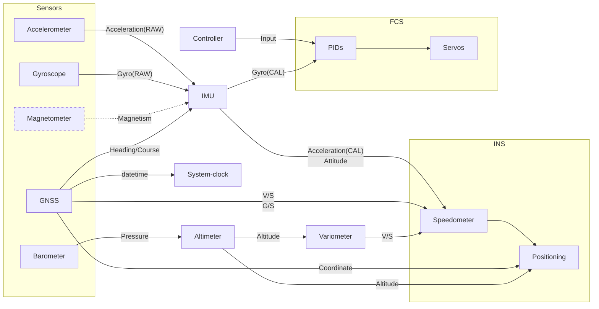

pro-flight
==========

Flight control software written in rust, aims to provide more convenience for developers
and better OSD experience for users.

Why pro-flight?
===============

There are some popular flight-control software like Betaflight, INAV, PX4 and ardupilot,
which is indeed mature and stable, while programming language they're using is C/C++ which
is a bit of outdated, and besides:
* all of them provides an ugly OSD
* Betaflight and INAV is written in C, and codestyle is not very good
* PX4 and ardupilot uses RTOS for concurrency, but with async and interrupt based thread
  RTOS is no longer nessesary, and we'll achieve minimum latency
* being lack of package manager their repository is huge, full filled with self made wheels

In conclusion, I want to customize my own flight-control software while not willing to
use C/C++.

Here's a sample OSD output:

Progress
========

**Implemented**

* Component
  - [x] IMU
  - [x] Logger
  - [x] YAML-like config
  - [x] software interrupt based event
* FCS
  - [x] PWM & ESC
  - [x] PID
* INS
  - [x] Displacement integral
  - [x] Complementary filter
* IO
  - [x] USB console serial
  - [x] DMA buffer descriptor
* OSD
  - [x] MAX7456 (With XMODEM font upload)
* Sensor
  - [x] MPU6000
  - [x] Gyroscope/Accelerometer
  - [x] Battery Voltage ADC
  - [x] Barometer
* protocol
  - [x] SBUS Receiver
  - [x] GNSS NMEA Protocol
  - [x] GNSS UBX Protocol
* misc
  - [x] Simulator

**WIP**

* IO
  - [ ] SDCARD read & write
  - [ ] DMA based SDCARD read & write

**Future**

* logging
  - [ ] Blackbox
* navigation
  - [ ] Magnetometer
  - [ ] DMA based I2C
  - [ ] QMC5883L
  - [ ] Waypoint navigation
* IMU
  - [ ] INS and setup calibration for more accurate displacement integral
  - [ ] Extended kalman filter
* protocol
  - [ ] Mavlink
* misc
  - [ ] Camera distortion adaption

Priority map
============

| Priority  | Module                         |
|-----------|--------------------------------|
| Systick   | Software interrupts            |
| Immediate | Serial RX, ESC and Servo       |
| Sensor    | USART DMA and Sensor Interrupt |
| System    | SPI/I²C DMA                    |
| Telemtry  | OSD                            |
| Main      | LED/CLI                        |

Framework
=========

