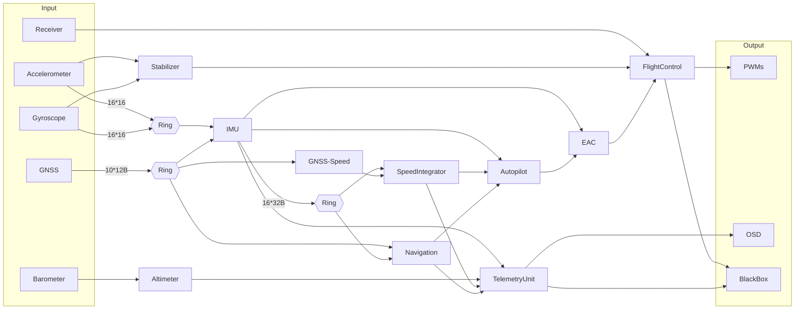

data flow
=========

```mermaid
graph LR
  subgraph Input
    Receiver
    Accelerometer
    Gyroscope
    Barometer
    GNSS
  end

  PostionRing{{Ring<Position>}}
  AccelGyroRing{{Ring<Accel, Gyro>}}
  GNSS --> |10*12B|PostionRing
  Accelerometer --> |16*16|AccelGyroRing
  Gyroscope --> |16*16|AccelGyroRing
  Accelerometer --> Stabilizer
  Gyroscope --> Stabilizer
  Barometer --> Altimeter

  PostionRing --> Navigation
  PostionRing --> GNSS-Speed

  AccelGyroRing --> IMU
  PostionRing --> IMU

  AccelQuatRing{{Ring<Accel, Quaternion>}}
  IMU --> |16*32B|AccelQuatRing
  AccelQuatRing --> Navigation
  AccelQuatRing --> SpeedIntegrator

  GNSS-Speed --> SpeedIntegrator

  IMU --> Autopilot
  SpeedIntegrator --> Autopilot
  Navigation --> Autopilot

  Receiver --> FlightControl
  Stabilizer --> FlightControl
  IMU --> EAC
  Autopilot --> EAC
  EAC --> FlightControl

  IMU --> TelemetryUnit
  Altimeter --> TelemetryUnit
  SpeedIntegrator --> TelemetryUnit
  Navigation --> TelemetryUnit

  subgraph Output
	PWMs
    OSD
    BlackBox
  end

  FlightControl --> PWMs
  FlightControl --> BlackBox
  TelemetryUnit --> OSD
  TelemetryUnit --> BlackBox
```
