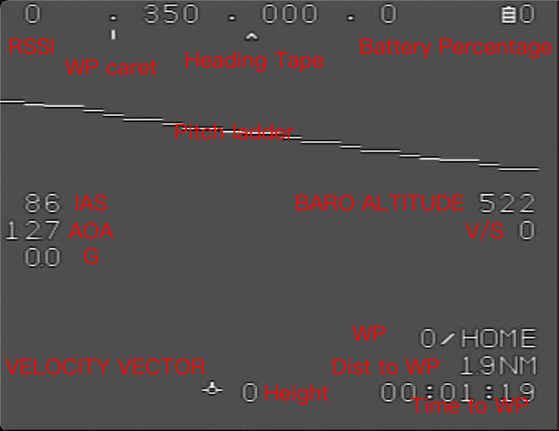

pro-flight
==========

Flight control software written in rust, aims to provider more convenience for developers
and better OSD experience for users.

Why pro-flight?
===============

There are some popular flight-control software like Betaflight, INAV, PX4 and ardupilot,
which is indeed mature and stable, while programming language they're using is C/C++ which
is a bit of outdated, and besides:
* all of them provides an ugly OSD
* Betaflight and INAV is written in C, and codestyle is not very good
* PX4 and ardupilot uses RTOS for concurrency, but with async and interrupt based thread
  RTOS is no longer nessesary, and we'll achieve minimum latency
* being lack of package manager their repository is huge, full filled with self made wheels

In conclusion, I want to customize my own flight-control software while not willing to
use C/C++.

Here's a sample OSD output:



Progress
========

**Implemented**

* Component
  - [x] IMU
  - [x] Logger
  - [x] YAML-like config
  - [x] Displacement integral
  - [x] Complementary filter
  - [x] software interrupt based event
* IO
  - [x] USB console serial
  - [x] DMA buffer descriptor
* HAL
  - [x] Gyroscope/Accelerometer
* OSD
  - [x] MAX7456 (With XMODEM font upload)
* Sensor
  - [x] MPU6000
  - [x] Battery Voltage ADC
  - [x] Barometer

**WIP**
  - [ ] SBUS Receiver
  - [ ] PWM & ESC

**Future**

* navigation
  - [ ] GNSS NMEA Protocol
  - [ ] GNSS UBX Protocol
  - [ ] Magnetometer
  - [ ] DMA based I2C
  - [ ] QMC5883L
  - [ ] Waypoint navigation
* IMU
  - [ ] INS and setup calibration for more accurate displacement integral
  - [ ] EKF filter
* fight-control
  - [ ] PID & Stabilizer
* logging
  - [ ] SDCARD read & write
  - [ ] DMA based SDCARD read & write
  - [ ] Blackbox
* protocol
  - [ ] Mavlink
* misc
  - [ ] Camera distortion adaption

data-flow
=========

* Speedometer

  ```plantuml
  @startuml
  ditaa

  +-----------+ Pressure +-----------+       Derivative
  | Barometer |--------->| Altimeter |-----------------+
  +-----------+          +-----------+                 |
                                                       v
  +---------------+ Accel  +-------+            +-------------+
  | Accelerometer |------->|       |            |             |
  +---------------+        |       | Integral   |             |
                           |  IMU  |----------->| Speedometer |
  +-----------+     Gyro   |       |            |             |
  | Gyroscope |----------->|       |            |             |
  +-----------+            +-------+            +-------------+
                                                       ^
  +-----------+                           Velocity     |
  | GNSS      |----------------------------------------+
  +-----------+
  ```

* SINS

  ```plantuml
  @startuml
  ditaa

  +-----------+ Pressure +-----------+       Altitude
  | Barometer |--------->| Altimeter |-------------+
  +-----------+          +-----------+             |
                                                   v
  +---------------+ Accel  +-------+            +------+
  | Accelerometer |------->|       |            |      |
  +---------------+        |       | Integral   |      |
                           |  IMU  |-------+--->| SINS |
  +-----------+     Gyro   |       |       |    |      |
  | Gyroscope |----------->|       |       |    |      |
  +-----------+            +-------+       |    +------+
                                           |       ^
                        +-------------+    |       |
                        | Speedometer |----+       |
                        +-------------+            |
  +-----------+  Position                          |
  | GNSS      |------------------------------------+
  +-----------+
  ```

* Output

  ```plantuml
  @startuml
  ditaa
  +-------------+         +-----+
  | Speedometer |-------->|     |  AoA
  +-------------+         | AoA |----------------+
                     +--->|     |                |
                     |    +-----+                v
  +-----+ Attitude   |                     +-----------+
  | IMU |------------+-------------------->| Stablizer |-------+
  +-----+                                  +-----------+       |
                                                               |
  +------+ Steerpoint   +-----------+                          |
  | SINS |------------->| Autopilot |---------------+          |
  +------+              +-----------+               |          |      +-----------+    +----------+
                                                    |          +----->|           |    |          |
  +----------+ Remote controller +---------------+  +---------------->|   Mixer   |--->|   PWMs   |
  | Receiver |------------------>| Configuration |------------------->|           |    |          |
  +----------+                   +---------------+                    +-----------+    +----------+
  ```

* Telemetry

  ```plantuml
  @startuml
  ditaa

  +-------------+       Speed vector                            +----------+
  | Speedometer |----+------------------------+             +-->| Blackbox |
  +-------------+    |                        |             |   +----------+
                     |     +-----+            v             |
                     +---->|     |  AoA   +-----------+     |
                           | AoA |------->| Telemetry |-----+
                     +---->|     |        +-----------+     |
                     |     +-----+          ^ ^             |
  +-----+            |                      | |             |
  | IMU |------------+----------------------+ |             |
  +-----+    Attitude                         |             |
                                              |             |
  +------+   Postion & Steerpoint             |             |   +----------+
  | SINS |------------------------------------+             +-->| HUD(OSD) |
  +------+                                                      +----------+
  @enduml
  ```
