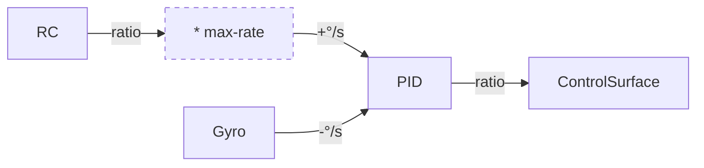

PID tuning
==========

The following figure illustrates how PID works:



So `kp` maps error Δ°/s into proportional control-surface axis.
Be aware that control-surface range is [-100.0, 100.0].

PID configuration looks like follows:

```yaml
  pids:
    roll:
      max-rate: 150
      kp: 0.44
      ki: 0.4
      kd: 0.2
    pitch:
      max-rate: 30
      kp: 0.58
      ki: 0.5
      kd: 0.22
    yaw:
      max-rate: 10
      kp: 0.7
      ki: 0.45
      kd: 0.2
```

* max-rate

  Maximum rate (degrees) when input is 100%

* kp

  Multiplier that convert error (degrees) to servo percentage

  Assuming your aircraft maximum roll rate is 270 degrees, 100% / 270 = 0.37,
  therefore pids.roll.kp should be 0.37
